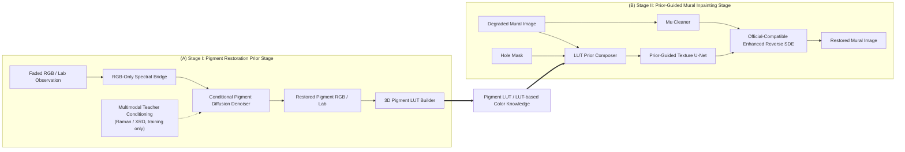
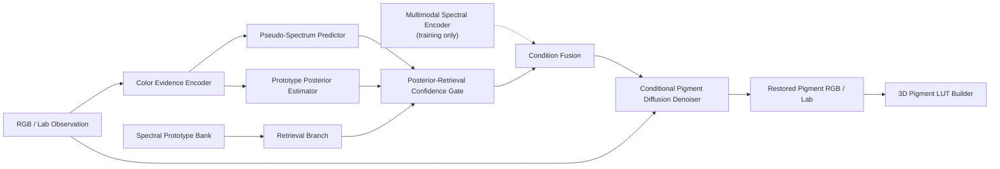
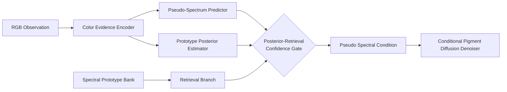
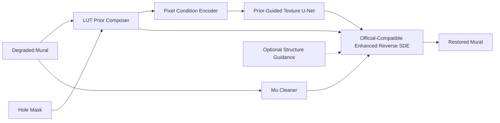
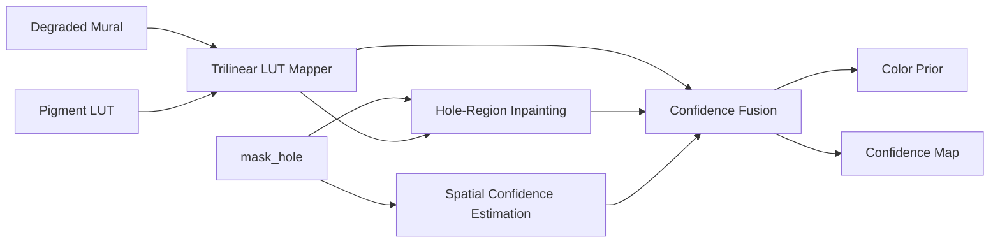
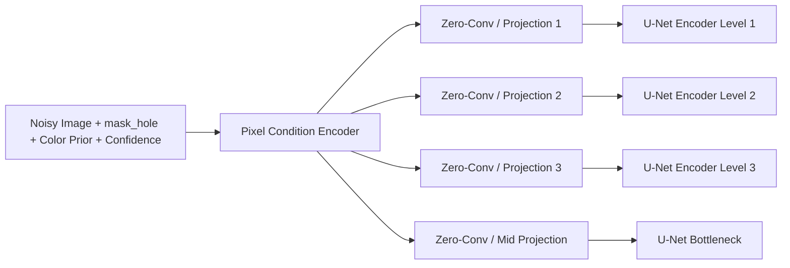
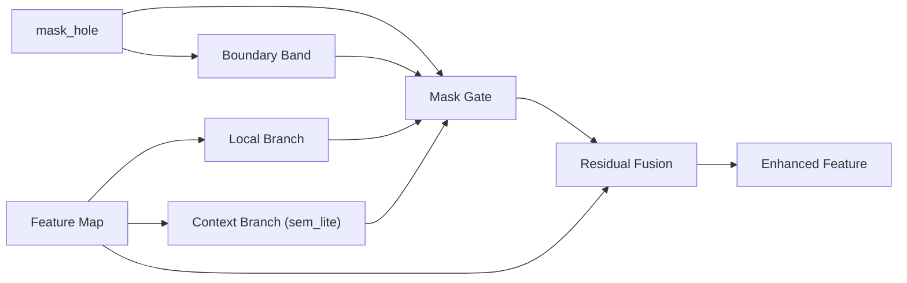
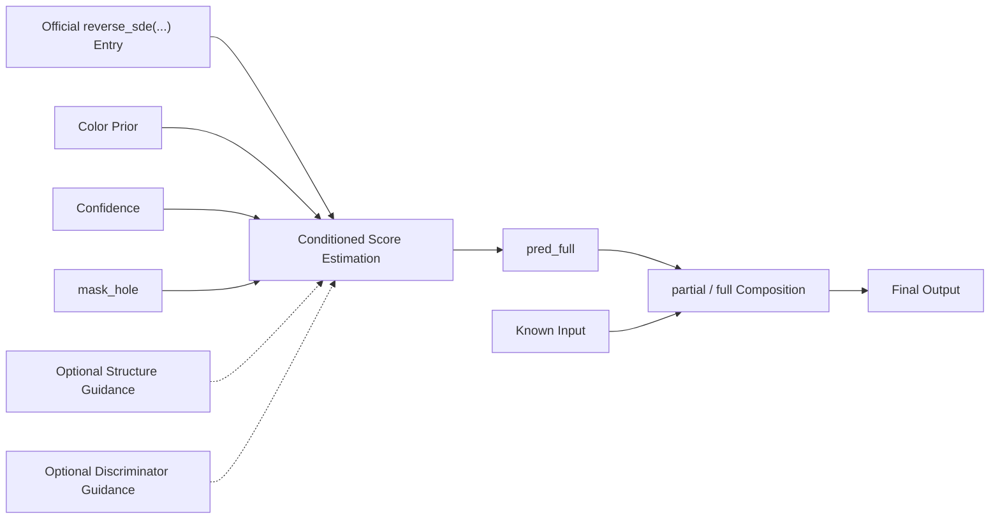

# Two-Stage Model Figure Atlas and Layout Guide

## 1. Purpose

This document is the execution version of the "structure-first" figure plan.

It is for three direct uses:

1. paper figure drafting
2. PPT figure production
3. future AI-assisted paper writing

The document does not try to beautify everything at once. It fixes the real structure first, and then gives concrete top-conference-style layout guidance for each figure. If a figure cannot be fully beautified now, keep the structural boxes and arrows, and use text placeholders exactly as specified here.

The method is organized as a true two-stage system:

- Stage I: `SSD-TS` based pigment restoration and LUT construction
- Stage II: `StrDiffusion` based prior-guided mural inpainting

The cross-stage interface is explicit:

- `single-color restoration -> pigment LUT -> mural color prior`

## 2. Global Rules

### 2.1 Naming

Use English paper-style labels in the figures. Code names can appear only in footnotes or speaker notes.

Stage I labels:

- `Multimodal Spectral Encoder`
- `Color Evidence Encoder`
- `Pseudo-Spectrum Predictor`
- `Prototype Posterior Estimator`
- `Spectral Prototype Bank`
- `Retrieval Branch`
- `Posterior-Retrieval Confidence Gate`
- `Conditional Pigment Diffusion Denoiser`
- `3D Pigment LUT Builder`

Stage II labels:

- `Trilinear LUT Mapper`
- `LUT Prior Composer`
- `Pixel Condition Encoder`
- `Prior-Guided Texture U-Net`
- `Mask-Gated Local Context Block`
- `Mu Cleaner`
- `Official-Compatible Enhanced Reverse SDE`
- `Optional Structure Guidance`
- `Optional Discriminator Guidance`

### 2.2 Color and line semantics

- Proposed modules: orange `#E4872E`
- Baseline or inherited backbone: blue-gray `#6F8197`
- Priors, masks, conditions, confidence: green `#63A66F`
- Training-only or optional branches: neutral gray `#A5ABB5`
- Cross-stage transfer: gold `#D9A441`

Line styles:

- Solid arrow: deployment-time active path
- Dashed arrow: training-only supervision or teacher-only path
- Thin gray branch: optional compatibility branch
- Thick gold arrow: Stage I to Stage II knowledge transfer

### 2.3 Typography and panel style

- Main title: 24-28 pt, sans-serif, bold
- Panel title: 15-18 pt, bold
- Box label: 11-13 pt
- Footnote or code mapping: 8-9 pt
- Use `(A)`, `(B)`, `(C)` style panel tags in bold at the top-left of each panel
- Use rounded rectangles for modules
- Use larger outer containers for stage backbones
- Do not use more than 4 color families in one page

### 2.4 Hard constraints

- Do not draw `ChromaticResidualRefiner` in the formal active-path figures
- Do not draw `true spectral condition` as inference-time input
- Do not replace Stage II with a fake new inference backbone; it must still enter via `reverse_sde(...)`
- `Pixel Condition Encoder` must be drawn as multi-scale injection, not a simple preprocessing block
- `MGLC` must be drawn inside the Stage II main backbone as feature enhancement, not as another prior encoder
- `Mu Cleaner` must appear before SDE in Stage II
- Stage II must explicitly distinguish `mask_hole` and `mask_known`

## 3. Figure Inventory and Selection

| ID | Figure | Role | Recommendation |
| --- | --- | --- | --- |
| Fig.1 | Overall Two-Stage Framework | Global overview | Main paper |
| Fig.2 | Dual-Baseline Reference Map | Explain "baseline -> ours" | Supplementary / defense |
| Fig.3 | Original SSD-TS Baseline Skeleton | Stage I baseline | Supplementary |
| Fig.4 | Enhanced Stage-I on SSD-TS | Stage I main architecture | Main paper or supp |
| Fig.5 | Multimodal Teacher Conditioning | Stage I training-only teacher | Supplementary |
| Fig.6 | RGB-Only Spectral Bridge | Stage I core innovation detail | Main paper |
| Fig.7 | Conditional Pigment Diffusion Backbone | Stage I denoiser backbone | Supplementary |
| Fig.8 | Stage-I Training Objectives | Training constraints | Supplementary |
| Fig.9 | Stage-I Inference Stabilization | Confidence and smoothing | Supplementary / defense |
| Fig.10 | 3D Pigment LUT Construction Pipeline | Cross-stage knowledge source | Supplementary or defense |
| Fig.11 | Official StrDiffusion Baseline Skeleton | Stage II baseline | Supplementary |
| Fig.12 | Enhanced Stage-II on StrDiffusion | Stage II main architecture | Main paper |
| Fig.13 | LUT Prior Composer | Stage II color prior detail | Main paper or supp |
| Fig.14 | Pixel Condition Encoder and Injection | Stage II core innovation detail | Main paper |
| Fig.15 | Prior-Guided Texture U-Net | Stage II backbone organization | Supplementary |
| Fig.16 | Mask-Gated Local Context Block | MGLC internal detail | Main paper or supp |
| Fig.17 | Mu Cleaner | Pre-SDE mu purification | Supplementary / defense |
| Fig.18 | Official-Compatible Enhanced Reverse SDE | Inference path detail | Main paper |
| Fig.19 | Stage-II Training vs Inference Semantics | Semantics and output rules | Supplementary |
| Fig.20 | Cross-Stage Interface Specification | LUT transfer contract | Supplementary |
| Fig.21 | Naming and Semantics Legend | Shared legend page | Defense |
| Fig.22 | Selection Guide | Which figures go where | Internal use |

Recommended paper-core subset:

- `Fig.1`
- `Fig.6`
- `Fig.12`
- `Fig.14`
- `Fig.18`

Recommended full defense subset:

- `Fig.1`
- `Fig.2`
- `Fig.6`
- `Fig.10`
- `Fig.12`
- `Fig.13`
- `Fig.16`
- `Fig.18`
- `Fig.21`

## 4. Core Figure Drafts

This section gives the most important figure structures in concrete draft form. These can be directly translated into PPT boxes and arrows.

### Fig.1 Overall Two-Stage Framework

**Purpose**

One-page global story of the whole method. A reader should understand the method before seeing any detail page.

**Structure Spec**

- Left half: Stage I `Pigment Restoration Prior Stage`
- Right half: Stage II `Prior-Guided Mural Inpainting Stage`
- Center bridge: `Pigment LUT / LUT-based color knowledge`
- Top or bottom strip: training-only supervision notes
- End output on far right: `Restored Mural Image`

**Mermaid draft**

**Style Note**

- Make Stage I and Stage II equal in width, but let Stage II be slightly larger because it is the final restoration stage
- Put a thick gold transfer ribbon between the two stages
- Use one image thumbnail placeholder at the left input and one at the final output
- Add two small callouts on the right edge or lower edge:
  - `Stage I detail -> Fig.6 / Fig.10`
  - `Stage II detail -> Fig.14 / Fig.16 / Fig.18`

**Placeholders**

- `Pigment Sample Placeholder`
- `Mural Input Placeholder`
- `Final Restoration Placeholder`
- `Pigment LUT Cube Placeholder`

**Code anchors**

- Stage I: `D:\code\ky\bihua\Impainting\SSD-TS\bridge`, `D:\code\ky\bihua\Impainting\SSD-TS\inference`, `D:\code\ky\bihua\Impainting\SSD-TS\pigment_task`
- Stage II: `D:\code\ky\bihua\Impainting\StrDiffusion+e00\train-3\texture\config\inpainting`, `D:\code\ky\bihua\Impainting\StrDiffusion+e00\train-3\_texture1_patch`

### Fig.4 Enhanced Stage-I Framework on Top of SSD-TS

**Purpose**

Show how Stage I evolves from the original `SSD-TS` baseline to the pigment-restoration version.

**Structure Spec**

- Start from a baseline diffusion backbone container
- Add top training branch for `Multimodal Spectral Encoder`
- Add RGB-only bridge branch for inference compatibility
- Add LUT builder at the far right
- Keep the central `Conditional Pigment Diffusion Denoiser` as the main backbone

**Mermaid draft**

**Style Note**

- Draw the central denoiser as a wide inherited container in blue-gray
- Draw all new bridge modules in orange and keep them above or to the left of the denoiser
- Use a memory-bank cylinder for `Spectral Prototype Bank`
- Make `Posterior-Retrieval Confidence Gate` a small diamond or fusion node

**Code anchors**

- `D:\code\ky\bihua\Impainting\SSD-TS\models\spectral_encoder.py`
- `D:\code\ky\bihua\Impainting\SSD-TS\models\color_encoder.py`
- `D:\code\ky\bihua\Impainting\SSD-TS\models\cond_predictor.py`
- `D:\code\ky\bihua\Impainting\SSD-TS\bridge\condition_builder.py`
- `D:\code\ky\bihua\Impainting\SSD-TS\bridge\prototype_bank.py`
- `D:\code\ky\bihua\Impainting\SSD-TS\bridge\confidence_gate.py`
- `D:\code\ky\bihua\Impainting\SSD-TS\pigment_task\build_pigment_lut33.py`

### Fig.6 RGB-Only Spectral Bridge

**Purpose**

This is the most important Stage I detail figure. It explains how inference works without real Raman/XRD.

**Structure Spec**

- Input: RGB observation only
- Path 1: color evidence to predicted pseudo-spectrum
- Path 2: color evidence to posterior features
- Path 3: prototype bank retrieval
- Gate fuses predictor, posterior, retrieval
- Output: pseudo spectral condition for diffusion denoiser

**Mermaid draft**

**Style Note**

- Use left-to-right flow
- Put the prototype bank above the retrieval branch with a cylinder icon
- Use a highlighted fusion node for the gate
- Add a tiny gray note under the panel:
  - `true spectral condition is available only during training`

**Placeholders**

- `Prototype Bank Placeholder`
- `Confidence Gate Placeholder`

### Fig.10 3D Pigment LUT Construction Pipeline

**Purpose**

Show how Stage I outputs become Stage II usable color knowledge.

**Structure Spec**

- Input: grid of RGB samples
- Single-color inference in batch
- Confidence and uncertainty diagnostics
- Optional temporal or statistical stabilization
- Output `.npz` containing `lut_rgb`, `lut_lab`, `lut_conf`, `lut_std`, `lut_cdiff`, `lut_cret`

**Style Note**

- Use a 3-step or 4-step pipeline
- At the far right, draw a cube or 3D lattice placeholder
- Under the cube, list output keys in small text
- Make this figure compact; it should explain data product, not backbone detail

### Fig.12 Enhanced Stage-II Framework on Top of StrDiffusion

**Purpose**

This is the main Stage II architecture figure and one of the most important figures in the paper.

**Structure Spec**

- Start from official `StrDiffusion` backbone logic
- Add `Trilinear LUT Mapper` and `LUT Prior Composer`
- Add `Mu Cleaner`
- Add `Pixel Condition Encoder`
- Add `MGLC` inside the main U-Net
- Keep the inference entry as `reverse_sde(...)`
- Keep `Optional Structure Guidance` as a gray side branch

**Mermaid draft**

**Style Note**

- Use the same overall silhouette as the baseline StrDiffusion figure
- Keep the baseline backbone in blue-gray and overlay your added modules in orange
- Let `Prior-Guided Texture U-Net` be the largest module container in the figure
- Show `LUT Prior Composer` and `Mu Cleaner` as upstream blocks of roughly equal size

**Code anchors**

- `D:\code\ky\bihua\Impainting\StrDiffusion+e00\train-3\texture\config\inpainting\color_prior_generator.py`
- `D:\code\ky\bihua\Impainting\StrDiffusion+e00\train-3\texture\config\inpainting\models\pixel_brushnet.py`
- `D:\code\ky\bihua\Impainting\StrDiffusion+e00\train-3\texture\config\inpainting\models\brushnet_wrapper.py`
- `D:\code\ky\bihua\Impainting\StrDiffusion+e00\train-3\texture\config\inpainting\models\modules\mglc_block.py`
- `D:\code\ky\bihua\Impainting\StrDiffusion+e00\train-3\texture\config\inpainting\models\mu_denoiser.py`
- `D:\code\ky\bihua\Impainting\StrDiffusion+e00\train-3\_texture1_patch\utils\sde_utils.py`

### Fig.13 LUT Prior Composer

**Purpose**

Explain how Stage II converts LUT knowledge into `color prior + confidence`.

**Structure Spec**

- Input 1: degraded mural
- Input 2: `mask_hole`
- Input 3: Stage I LUT
- Internal steps:
  - `known-pixel LUT mapping`
  - `hole-region inpainting`
  - `spatial confidence estimation`
  - `confidence fusion`
- Output:
  - `color prior`
  - `confidence map`

**Mermaid draft**

**Style Note**

- Use two outputs from the same final fusion box
- Put the LUT cube above or behind the `Trilinear LUT Mapper`
- Use a small green confidence heatmap placeholder for the confidence output

### Fig.14 Pixel Condition Encoder and Multi-Scale Injection

**Purpose**

Explain the key Stage II conditional injection mechanism.

**Structure Spec**

- Input channels:
  - noisy image
  - `mask_hole`
  - color prior
  - confidence
- Encoder branch produces:
  - down features
  - mid feature
- `zero-conv` or projection blocks align features
- Multi-scale arrows inject into main U-Net encoder and bottleneck

**Mermaid draft**

**Style Note**

- This page should visually resemble BrushNet-like plug-in injection
- Put the encoder side branch on the left, the main U-Net levels on the right
- Use 4 parallel injection arrows, evenly spaced
- Make `Pixel Condition Encoder` orange and the U-Net levels blue-gray

### Fig.16 Mask-Gated Local Context Block

**Purpose**

Explain the internal design of `MGLC`.

**Structure Spec**

- Inputs:
  - feature map
  - `mask_hole`
- Internal branches:
  - `local branch`
  - `context branch`
  - `boundary band`
  - `mask gate`
- Output:
  - residual fused feature
- Footnote:
  - supports `sem_lite`
  - supports `branch_mode`
  - supports `mid` and `decoder` insertion

**Mermaid draft**

**Style Note**

- Use a left-input, center-branches, right-output layout
- Make `Mask Gate` a small center diamond or rounded diamond
- Use a light green band behind the mask-related nodes to emphasize geometry awareness
- Add a small note under the figure:
  - `inserted at bottleneck and decoder`

### Fig.17 Mu Cleaner

**Purpose**

Explain the pre-SDE `mu` purification path.

**Structure Spec**

- Input:
  - degraded RGB
  - `mask_known`
  - confidence
- Internal steps:
  - blind-spot corruption
  - lightweight denoiser
- Output:
  - `mu_clean`
- Note:
  - only known region is preserved

**Style Note**

- Keep it compact
- Put it either as a narrow horizontal pipeline or as a vertical pre-processing box
- Add one footnote:
  - `applied before random state generation / reverse SDE`

### Fig.18 Official-Compatible Enhanced Reverse SDE

**Purpose**

Explain that inference is enhanced but remains official-entry compatible.

**Structure Spec**

- Entry node: `reverse_sde(...)`
- Conditions:
  - `mask_hole`
  - color prior
  - confidence
  - optional structure guidance
  - optional discriminator guidance
- Output:
  - `pred_full`
  - `partial/full composition`

**Mermaid draft**

**Style Note**

- Emphasize compatibility by making the entry node visually official and inherited
- Make optional branches gray and thin
- If there is no room, collapse the optional branches into one small side legend

## 5. Remaining Figure Specs

The figures below do not need full mermaid drafts if time is limited, but their structure must follow these rules.

### Fig.2 Dual-Baseline Reference Map

- Left: `original SSD-TS baseline skeleton`
- Right: `official StrDiffusion baseline skeleton`
- Center overlay or lower strip: `ours added modules`
- Layout: split-page comparison
- Best use: defense, supplementary

### Fig.3 Original SSD-TS Baseline Skeleton

- Show only the generic diffusion backbone and original condition path
- No prototype bank, no LUT builder, no retrieval gate
- Use low-saturation blue-gray only

### Fig.5 Multimodal Teacher Conditioning

- Show Raman and XRD entering the `Multimodal Spectral Encoder`
- Output goes to Stage I condition fusion or denoiser
- Dashed-only arrows for teacher path
- Put a label: `training only`

### Fig.7 Conditional Pigment Diffusion Backbone

- Show `observation`, `condition`, and time-step embedding entering the denoiser
- Show denoising blocks as a repeated stack
- Make the denoiser container wide and central

### Fig.8 Stage-I Training Objectives and Auxiliary Constraints

- Bottom strip layout works best
- Split losses into:
  - core diffusion loss
  - bridge alignment losses
  - optional physics constraints
- Avoid mixing this page with deployment logic

### Fig.9 Stage-I Inference Stabilization and Diagnostics

- Show:
  - confidence
  - diffusion uncertainty
  - low-confidence fallback or stabilization
  - Kalman/RTS smoothing
- Use a post-processing chain layout

### Fig.11 Official StrDiffusion Baseline Skeleton

- Preserve the official logic:
  - conditional generator
  - structure generator
  - discriminator
  - reverse SDE flow
- No BrushNet, no MGLC, no Mu Cleaner

### Fig.15 Prior-Guided Texture U-Net

- Show a baseline U-Net container
- Mark where `Pixel Condition Encoder` injections enter
- Mark where `MGLC` is inserted
- Mark optional `structure guidance`
- This is a "container organization" page, not an internal math page

### Fig.19 Stage-II Training vs Inference Semantics

- Left column: training semantics
- Right column: inference semantics
- Must explicitly include:
  - `mask_for_sde = 1 - mask`
  - `mask_hole` vs `mask_known`
  - `gt_mode = partial/full`
  - `mu_clean before SDE`
  - `save_intermediates`

### Fig.20 Cross-Stage Interface Specification

- Draw Stage I `pigment LUT` as the only required cross-stage artifact
- Show it entering `Trilinear LUT Mapper`
- Optional small footnote listing stored keys:
  - `lut_rgb`
  - `lut_lab`
  - `lut_conf`
  - `lut_std`
  - `lut_cdiff`
  - `lut_cret`

### Fig.21 Naming and Semantics Legend

- Put all shared terminology in one place
- Include color legend, line legend, mask semantics, and optional branch semantics
- This page is practical for答辩 and internal alignment

### Fig.22 Selection Guide

- Organize into three blocks:
  - `Main Paper`
  - `Supplementary`
  - `Defense`
- This page is internal and does not need fancy styling

## 6. Page-Level Layout Templates

### Template A: one dominant overview + side callouts

Use for:

- `Fig.1`
- `Fig.12`

Layout:

- 65% width main architecture
- 35% width for 2 or 3 stacked detail callouts
- Best when the paper needs one visual center

### Template B: left-to-right dataflow + bottom strip

Use for:

- `Fig.6`
- `Fig.10`
- `Fig.18`

Layout:

- Main flow in the middle
- Losses or notes in a thin bottom strip
- Best for pipeline explanation

### Template C: baseline vs ours comparison

Use for:

- `Fig.2`
- `Fig.4`
- `Fig.11`

Layout:

- left/right comparison or top/bottom comparison
- baseline always lower saturation
- added modules always highlighted

### Template D: module anatomy page

Use for:

- `Fig.13`
- `Fig.14`
- `Fig.16`
- `Fig.17`

Layout:

- single centered module
- clear input and output sides
- 2 or 3 internal branches only
- concise footnote under the module

## 7. Placeholder Library

When a real image or styled icon is not available yet, use these exact placeholders.

Image placeholders:

- `Degraded Mural Placeholder`
- `Mask Placeholder`
- `Restored Pigment Placeholder`
- `Final Output Placeholder`

Condition placeholders:

- `Pseudo Spectral Condition Placeholder`
- `Color Prior Placeholder`
- `Confidence Heatmap Placeholder`
- `Mu Clean Placeholder`

Structural placeholders:

- `Prototype Bank Placeholder`
- `3D LUT Cube Placeholder`
- `U-Net Container Placeholder`
- `Boundary Band Placeholder`

Each placeholder should be a light-gray box with centered text and a 1.0-1.5 pt outline. Add a nearby comment in speaker notes or draft notes describing what should replace it later.

## 8. Baseline-Reference Mapping

Use the baseline papers only as layout language references, not as semantic templates.

### StrDiffusion reference

Use it for:

- the main Stage II overview silhouette
- the structure-guided diffusion story
- the iterative reverse-SDE presentation

Do not copy:

- its exact node names
- any semantics that no longer match your active path

### BrushNet reference

Use it for:

- side-branch design
- plug-in conditional encoder look
- layer-wise injection arrows

Do not copy:

- latent-space-only assumptions
- direct original paper terminology if it conflicts with your current implementation

### DiffImp / SSD-TS style reference

Use it for:

- block decomposition
- denoiser backbone drawing
- teacher/student or condition/backbone split

Do not copy:

- generic time-series task wording
- any input semantics that do not fit the pigment-restoration task

## 9. Production Order

If you are making the figures now, use this order:

1. `Fig.1`
2. `Fig.6`
3. `Fig.12`
4. `Fig.14`
5. `Fig.16`
6. `Fig.18`
7. `Fig.10`
8. `Fig.2`
9. remaining supplementary pages

This order gives you a usable paper set early and preserves time for style cleanup.

## 10. Final Checklist Before Drawing

- Does `Fig.1` clearly show this is a two-stage method?
- Does `Fig.6` make RGB-only inference possible without fake teacher access?
- Does `Fig.12` still look like an enhanced StrDiffusion rather than a totally unrelated model?
- Does `Fig.14` clearly show multi-scale injection?
- Does `Fig.16` clearly show local/context/mask-gate logic?
- Does `Fig.18` clearly show official entry compatibility?
- Are `mask_hole` and `mask_known` never mixed?
- Is `ChromaticResidualRefiner` absent from all formal active-path figures?
- Are optional branches visually weaker than proposed main modules?
- Does every figure use the same color and line semantics?

## 11. Code Evidence Summary

Stage I evidence:

- `D:\code\ky\bihua\Impainting\SSD-TS\models\spectral_encoder.py`
- `D:\code\ky\bihua\Impainting\SSD-TS\models\color_encoder.py`
- `D:\code\ky\bihua\Impainting\SSD-TS\models\cond_predictor.py`
- `D:\code\ky\bihua\Impainting\SSD-TS\bridge\condition_builder.py`
- `D:\code\ky\bihua\Impainting\SSD-TS\bridge\prototype_bank.py`
- `D:\code\ky\bihua\Impainting\SSD-TS\bridge\confidence_gate.py`
- `D:\code\ky\bihua\Impainting\SSD-TS\inference\pipeline.py`
- `D:\code\ky\bihua\Impainting\SSD-TS\pigment_task\build_pigment_lut33.py`

Stage II evidence:

- `D:\code\ky\bihua\Impainting\StrDiffusion+e00\train-3\texture\config\inpainting\color_prior_generator.py`
- `D:\code\ky\bihua\Impainting\StrDiffusion+e00\train-3\texture\config\inpainting\data\mural_inpainting_dataset.py`
- `D:\code\ky\bihua\Impainting\StrDiffusion+e00\train-3\texture\config\inpainting\models\pixel_brushnet.py`
- `D:\code\ky\bihua\Impainting\StrDiffusion+e00\train-3\texture\config\inpainting\models\brushnet_wrapper.py`
- `D:\code\ky\bihua\Impainting\StrDiffusion+e00\train-3\texture\config\inpainting\models\modules\mglc_block.py`
- `D:\code\ky\bihua\Impainting\StrDiffusion+e00\train-3\texture\config\inpainting\models\mu_denoiser.py`
- `D:\code\ky\bihua\Impainting\StrDiffusion+e00\train-3\texture\config\inpainting\models\denoising_model.py`
- `D:\code\ky\bihua\Impainting\StrDiffusion+e00\train-3\_texture1_patch\models\denoising_model.py`
- `D:\code\ky\bihua\Impainting\StrDiffusion+e00\train-3\_texture1_patch\utils\sde_utils.py`

---

If you want the next step, the best follow-up is to convert `Fig.1`, `Fig.6`, `Fig.12`, `Fig.14`, `Fig.16`, and `Fig.18` into a PPT-ready page-by-page drafting script with exact box positions and text lengths.
