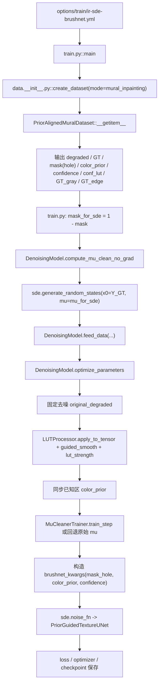
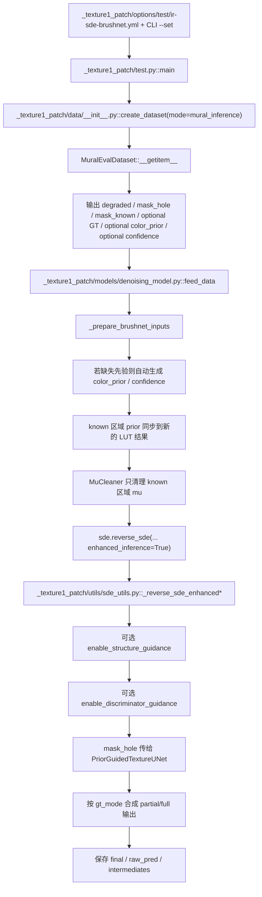

# StrDiffusion 改进版总说明书（相对官方 baseline）

本文档用于系统整理当前项目相对官方 StrDiffusion baseline 的全部有效改动，并明确哪些内容属于核心创新、哪些属于配套增强、哪些只是兼容项或保留项。本文档的目标不是宣传，而是给后续论文写作、AI 辅助写作、实验复现和代码回溯提供统一事实源。

默认比较对象：

- 训练 baseline：`texture/config/inpainting/options/train/ir-sde.yml` 对应的官方训练路径，核心为 `ConditionalUNet + GTDataset + 单主干 IR-SDE`。
- 推理 baseline：`_texture1_patch/options/test/ir-sde.yml` 所保留的官方 `G/Gs/Dis` 骨架与 `reverse_sde(...)` 入口。
- 当前主训练树：`texture/config/inpainting`
- 当前主推理树：`_texture1_patch`

本文档的事实优先级如下：

1. active code path
2. active config
3. 本文档
4. 旧的设计说明、MVP 报告、README

这意味着：如果旧文档与当前 active code 不一致，以当前代码为准。

## 1. 项目定位与 Baseline 定义

当前项目面向壁画退化修复，实际处理的是两个同时存在的问题：

- 颜色恢复：将退化、偏色、褪色图像恢复到目标颜色分布。
- 区域修补：对 hole / 缺损区域完成纹理和结构恢复。

相对 baseline，当前系统已经不再是“单个条件扩散主干直接从输入到输出”的形式，而是变成了“先验构造 + 条件注入 + 纹理增强 + 条件均值清理 + 官方骨架兼容推理”的组合系统。

### 1.1 训练 baseline

| 项目 | baseline |
| --- | --- |
| 训练配置 | `texture/config/inpainting/options/train/ir-sde.yml` |
| 主生成器 | `models/modules/DenoisingUNet_arch.py::ConditionalUNet` |
| 数据模式 | `GT` |
| 颜色先验 | 无 |
| BrushNet | 无 |
| MGLC | 无 |
| MuCleaner | 无 |
| 结构引导 | 走官方 `ConditionalUNet` 内部 SPADE 结构链 |

### 1.2 推理 baseline

| 项目 | baseline |
| --- | --- |
| 推理配置 | `_texture1_patch/options/test/ir-sde.yml` |
| 纹理生成器 | `ConditionalUNet` |
| 结构生成器 | `ConditionalUNets` |
| 判别器 | `Dis` |
| reverse 入口 | `_texture1_patch/utils/sde_utils.py::IRSDE.reverse_sde` |
| mask 形式 | 单一 `mask`，主要沿官方结构链使用 |
| 先验图/置信度 | 无 |

### 1.3 当前 active 模型定位

当前实际运行的是一个“官方骨架之上的增强版”：

- 训练侧 active generator：`models/brushnet_wrapper.py::ConditionalUNetWithBrushNet`
- 推理侧 active generator：`_texture1_patch/models/brushnet_wrapper.py::ConditionalUNetWithBrushNet`
- 训练侧 active config：`texture/config/inpainting/options/train/ir-sde-brushnet.yml`
- 推理侧 active config：`_texture1_patch/options/test/ir-sde-brushnet.yml`

因此，后文所有“当前系统”都指这条增强路径，而不是仓库里所有存在过的实验文件。

## 2. 仓库拓扑与 Active Path

### 2.1 目录分工

| 目录 | 角色 | 是否 active |
| --- | --- | --- |
| `texture/config/inpainting` | 当前训练主树 | 是 |
| `_texture1_patch` | 当前官方骨架兼容的推理主树 | 是 |
| `texture/config/inpainting/PROJECT_PAPER_GUIDE.md` | 旧的项目总说明 | 参考，不是最终事实源 |
| `texture/config/inpainting/MGLC_MVP_DESIGN_REPORT.md` | MGLC MVP 设计文档 | 参考 |
| `texture/config/inpainting/MGLC_MVP_ENHANCEMENT_REPORT.md` | MGLC 后续增强路线 | 参考 |
| `_texture1_patch/ABLATION_GUIDE.md` | 推理消融建议 | 参考 |

### 2.2 当前 active 入口

| 场景 | 入口文件 | 配置文件 | 关键装配点 |
| --- | --- | --- | --- |
| 训练 | `texture/config/inpainting/train.py::main` | `texture/config/inpainting/options/train/ir-sde-brushnet.yml` | `texture/config/inpainting/models/networks.py::define_G` |
| 推理 | `_texture1_patch/test.py::main` | `_texture1_patch/options/test/ir-sde-brushnet.yml` | `_texture1_patch/models/networks.py::define_G` |

### 2.3 Active path 的最短理解

训练主链：

1. `train.py` 读取增强配置。
2. `data.__init__.py::create_dataset` 创建 `MuralInpaintingDataset`。
3. `models/networks.py::define_G` 创建 `ConditionalUNetWithBrushNet`。
4. `models/denoising_model.py` 组织 LUT、MuCleaner、SDE、loss 和保存逻辑。

推理主链：

1. `_texture1_patch/test.py` 读取增强配置和 CLI override。
2. `_texture1_patch/data/__init__.py::create_dataset` 创建 `MuralInferenceDataset`。
3. `_texture1_patch/models/denoising_model.py` 处理先验、mu、结构链和输出保存。
4. `_texture1_patch/utils/sde_utils.py::IRSDE.reverse_sde` 保留官方入口，在内部切入 enhanced inference 分支。

## 3. 改动总表

本节按“核心创新 / 配套增强 / 兼容项 / 保留项”四层汇总。判断标准如下：

- 核心创新：进入 active path，且相对 baseline 形成新的方法组成部分。
- 配套增强：进入 active path，但更适合写成训练/推理工程增强或方法支撑。
- 兼容项：用于恢复官方路径或保留官方能力，不计入主创新。
- 保留项：代码存在，但当前 active path 未接入。

### 3.1 核心创新

| 文档名（代码名） | baseline | 当前实现 | 主要配置 | 代码证据 | active | 计入论文主创新 |
| --- | --- | --- | --- | --- | --- | --- |
| `LUTPriorComposer` (`ColorPriorGenerator`) | baseline 无显式颜色先验图与置信度图 | 基于 LUT 生成 `color_prior` 与 `confidence`，并对 hole 区域做修复填充 | `datasets.*.lut_path` `lut_alpha` `lut_beta` `lut_inpaint_method` `prior_method` | `color_prior_generator.py::ColorPriorGenerator` `data/mural_inpainting_dataset.py::__getitem__` `_texture1_patch/models/denoising_model.py::_prepare_brushnet_inputs` | 是 | 是 |
| `PixelConditionEncoder` (`PixelBrushNet`) | baseline 主干只接收 `xt` 和 `cond` | 将 `noisy + mask + color_prior + confidence` 拼为 8 通道像素输入，输出多尺度条件特征和 mid 特征 | `brushnet.enabled` `brushnet.in_nc` `brushnet.lite` | `models/pixel_brushnet.py::PixelBrushNet` `models/brushnet_wrapper.py::ConditionalUNetWithBrushNet.forward` | 是 | 是 |
| `MaskGatedLocalContextBlock` (`MGLCBlock`) | baseline 无单独纹理核心增强块 | 在 BrushNet 融合后追加局部/上下文双分支纹理增强，可插入 mid 和 decoder，带 mask gate 与 boundary band | `texture_core.enabled` `insert_mid` `insert_dec` `backend` `branch_mode` `use_mask_gate` `gate_hidden` `boundary_width` `zero_init_last` | `models/modules/mglc_block.py::MGLCBlock` `models/brushnet_wrapper.py::__init__` `models/brushnet_wrapper.py::forward` | 是 | 是 |
| `MuCleaner` (`MuDenoiser`) | baseline 直接用 `mu = degraded * mask_known` | 先对 `mu` 做自监督 blind-spot 清理，再交给 SDE | `mu_denoiser.enabled` `in_nc` `dim` `num_blocks` `num_heads` `blind_ratio` `lambda_ss` `lambda_tv` `lr` | `models/mu_denoiser.py::MuDenoiser` `models/denoising_model.py::compute_mu_clean_no_grad` `models/denoising_model.py::optimize_parameters` `_texture1_patch/models/denoising_model.py::_prepare_brushnet_inputs` | 是 | 是 |

### 3.2 配套增强

| 文档名（代码名） | 作用 | 相对 baseline 的变化 | 主要配置 | 代码证据 | active | 是否单列论文主创新 |
| --- | --- | --- | --- | --- | --- | --- |
| `TrilinearLUTMapper` (`LUTProcessor`) | LUT 三线性映射器 | baseline 无 LUT 映射器；当前同时服务于先验生成和训练目标构造 | `datasets.*.lut_path` `lut_strength` `lut_smooth_radius` | `lut_processor.py::LUTProcessor` `models/denoising_model.py::optimize_parameters` `_texture1_patch/models/denoising_model.py::_prepare_brushnet_inputs` | 是 | 否，作为前置基础模块 |
| `PriorAlignedMuralDataset` (`MuralInpaintingDataset`) | 训练数据集 | baseline 用 `GTDataset`；当前支持 `full/partial/mixed` GT、羽化融合、动态 mask、先验和置信度输出 | `datasets.train.mode` `gt_mode` `prior_method` `dataroot_mask` `lut_*` | `data/__init__.py::create_dataset` `data/mural_inpainting_dataset.py::MuralInpaintingDataset` | 是 | 否，写为配套增强 |
| `PriorGuidedTextureUNet` (`ConditionalUNetWithBrushNet`) | 当前 active 主干容器 | baseline 为 `ConditionalUNet`；当前统一承载 BrushNet、MGLC、可选结构引导 | `network_G.which_model_G` `brushnet.*` `texture_core.*` `restore_S_guidance` | `models/networks.py::define_G` `models/brushnet_wrapper.py::ConditionalUNetWithBrushNet` | 是 | 否，作为主干载体 |
| `MuralEvalDataset` (`MuralInferenceDataset`) | 推理数据集 | baseline 推理路径主要沿官方测试数据形式；当前显式返回 `mask_known` / `mask_hole` 与可选外部先验 | `datasets.test.mode` `dataroot_degraded` `dataroot_mask` `dataroot_GT` `dataroot_color_prior` `dataroot_confidence` | `_texture1_patch/data/__init__.py::create_dataset` `_texture1_patch/data/mural_inference_dataset.py::MuralInferenceDataset` | 是 | 否，写为推理配套 |
| 训练目标与 prior 同步 | 训练逻辑增强 | baseline 没有“先固定去噪，再 LUT 变换，再已知区 prior 同步”的过程 | `gt_mode` `lut_strength` `lut_smooth_radius` | `models/denoising_model.py::optimize_parameters` | 是 | 否 |
| 推理树 retrofit | 官方骨架兼容增强 | baseline 没有真实壁画推理数据集、自动先验生成、intermediate 导出和 CLI override | `inference.mode` `save_states` `save_intermediates` `--set` | `_texture1_patch/options.py::parse` `_texture1_patch/test.py::main` `_texture1_patch/models/denoising_model.py::test` | 是 | 否 |
| 联合 checkpoint 与 debug | 工程支撑 | baseline 不保存 `mu_denoiser.*` 参数，也没有当前这一套 debug 视图 | `debug.enabled` `debug.save_freq` | `models/denoising_model.py::save` `debug_utils.py::*` `_texture1_patch/models/denoising_model.py::_save_intermediate_outputs` | 是 | 否 |

### 3.3 兼容项

| 文档名（代码名） | 性质 | 当前作用 | 代码证据 | active | 计入论文主创新 |
| --- | --- | --- | --- | --- | --- |
| `enable_structure_guidance` (`restore_S_guidance`) | baseline compatibility fix | 在增强版 wrapper 中恢复官方结构引导路径，使 `Gs + S_sde + SPADE` 重新参与纹理主干 | `models/networks.py::define_G` `models/brushnet_wrapper.py::__init__` `models/brushnet_wrapper.py::forward` `_texture1_patch/utils/sde_utils.py::_reverse_sde_enhanced` | 是 | 否 |
| `enable_discriminator_guidance` (`inference.discriminator_guidance.enabled`) | official inference compatibility item | 推理期可选启用判别器引导的增强 reverse 分支 | `_texture1_patch/models/denoising_model.py::__init__` `_texture1_patch/models/denoising_model.py::test` `_texture1_patch/utils/sde_utils.py::_reverse_sde_enhanced_with_discriminator` | 默认关闭，但代码 active | 否 |

### 3.4 当前不应误判为主创新的内容

| 项目 | 说明 |
| --- | --- |
| `ConditionalUNetWithBrushNet` | 它是当前主干容器，不建议当作“第五个创新点”；真正的方法增量来自其内部挂载的 `LUTPriorComposer`、`PixelConditionEncoder`、`MaskGatedLocalContextBlock` 和 `MuCleaner`。 |
| `TrilinearLUTMapper` | 它是 `LUTPriorComposer` 与训练目标构造的基础工具，不建议单独扩写成独立创新点。 |
| `enable_structure_guidance` | 本质上是恢复 baseline 的官方结构链，而不是新增结构分支。 |
| `enable_discriminator_guidance` | 只属于推理策略对照项，不宜写成主体方法创新。 |

## 4. 模块命名表

下表给出建议用于论文与技术文档的保守学术命名。代码名不改，文档中第一次出现时采用“文档名（代码名）”形式，后文只用文档名。

| 代码名 | 文档名 | 中文名 | 归类 |
| --- | --- | --- | --- |
| `LUTProcessor` | `TrilinearLUTMapper` | 三线性 LUT 映射器 | 核心前置模块 |
| `ColorPriorGenerator` | `LUTPriorComposer` | LUT 先验合成器 | 核心创新 |
| `MuralInpaintingDataset` | `PriorAlignedMuralDataset` | 先验对齐壁画训练集 | 配套增强 |
| `PixelBrushNet` | `PixelConditionEncoder` | 像素条件编码器 | 核心创新 |
| `PixelBrushNetLite` | `PixelConditionEncoderLite` | 轻量像素条件编码器 | 配套变体 |
| `ConditionalUNetWithBrushNet` | `PriorGuidedTextureUNet` | 先验引导纹理 U-Net | 核心主干 |
| `MGLCBlock` | `MaskGatedLocalContextBlock` | 掩膜门控局部上下文块 | 核心创新 |
| `MuDenoiser` | `MuCleaner` | 条件均值清理器 | 核心创新 |
| `MuDenoiserTrainer` | `MuCleanerTrainer` | 条件均值清理训练器 | 配套增强 |
| `MuralInferenceDataset` | `MuralEvalDataset` | 壁画推理数据集 | 推理配套 |
| `restore_S_guidance` | `enable_structure_guidance` | 结构引导开关 | 兼容项 |
| `discriminator_guidance` | `enable_discriminator_guidance` | 判别器引导开关 | 兼容项 |
| `chroma_refiner.py` | `ChromaticResidualRefiner` | 色度残差精炼器 | 未激活保留项 |

## 5. 训练全流程

### 5.1 训练数据流图



### 5.2 训练流程逐步说明

#### Step 1. 读取增强配置并创建主模型

- 入口：`texture/config/inpainting/train.py::main`
- 训练配置：`texture/config/inpainting/options/train/ir-sde-brushnet.yml`
- 生成器装配：`texture/config/inpainting/models/networks.py::define_G`

当前默认训练配置中的关键启用状态：

- `network_G.which_model_G = ConditionalUNetWithBrushNet`
- `brushnet.enabled = true`
- `texture_core.enabled = true`
- `texture_core.insert_mid = true`
- `texture_core.insert_dec = true`
- `texture_core.backend = sem_lite`
- `texture_core.branch_mode = both`
- `restore_S_guidance = true`
- `mu_denoiser.enabled = true`
- `datasets.train.mode = mural_inpainting`

#### Step 2. 数据集生成训练样本

- 数据集入口：`texture/config/inpainting/data/mural_inpainting_dataset.py::MuralInpaintingDataset`
- 创建入口：`texture/config/inpainting/data/__init__.py::create_dataset`

`PriorAlignedMuralDataset` 返回的 active 字段包括：

- `degraded`：原始褪色图
- `GT` / `gt`：训练目标
- `mask`：数据集语义下的 hole mask，`1 = hole`
- `color_prior`
- `confidence`
- `conf_lut`
- `GT_gray`
- `GT_edge`

这里相对 baseline 的关键变化有三点：

1. 不再只返回 `GT`，而是返回完整的颜色先验链。
2. 数据集内部支持 `gt_mode = full / partial / mixed`。
3. 训练集内部直接输出 `conf_lut`，作为保留接口供 `ChromaticResidualRefiner` 使用。

#### Step 3. 颜色先验与置信度在数据集侧先生成一次

数据集侧使用 `LUTPriorComposer` 生成 `color_prior` 和 `confidence`：

- 先做 `TrilinearLUTMapper.trilinear_interpolate(...)`
- 再对 hole 区域做 `multi_scale_inpaint(...)`
- 再按空间距离和 LUT 置信度融合 `confidence`

hole 区域置信度公式按当前代码应写为：

`confidence_hole = spatial_conf * (alpha * conf_lut + beta * conf_inpaint)`

known 区域则直接设为：

`confidence_known = 1.0`

对应代码证据：

- `texture/config/inpainting/color_prior_generator.py::generate_fast`
- `texture/config/inpainting/color_prior_generator.py::generate_quality`
- `texture/config/inpainting/color_prior_generator.py::get_spatial_confidence`

#### Step 4. 训练入口把数据集 mask 转成 SDE 语义

这是整个项目最容易混淆的地方。

当前约定：

- 数据集 mask：`1 = hole`
- SDE / MuCleaner 的 `mask_known`：`1 = known`
- BrushNet / MGLC 使用的 mask：`1 = hole`

训练入口的转换在：

- `texture/config/inpainting/train.py`

具体逻辑：

- mural 模式下：`mask_for_sde = 1 - mask`
- 原始官方数据模式下：`mask_for_sde = mask`

所以训练时真正传给 SDE 的 mask 是 `mask_for_sde`，而不是原始数据集 `mask`。

#### Step 5. 先计算 `mu_clean`，再采样随机状态

相对 baseline，这一步非常关键。

baseline：

- 直接用 `mu = degraded * mask_known`

当前增强版：

- 先调用 `DenoisingModel.compute_mu_clean_no_grad(...)`
- 若 `MuCleaner` 启用，则用 `MuCleanerTrainer.inference(...)` 清理 `mu`
- 再把 `mu_clean * mask_known` 作为 `mu_for_sde`
- 最后调用 `sde.generate_random_states(x0=Y_GT, mu=mu_for_sde)`

这样做的目的，是保证：

- `generate_random_states(...)` 和 `optimize_parameters(...)` 使用的是同一个 `mu_clean`
- 避免 “采样时的 mu” 与 “训练时的 mu” 不一致

对应代码证据：

- `texture/config/inpainting/train.py::main`
- `texture/config/inpainting/models/denoising_model.py::compute_mu_clean_no_grad`

#### Step 6. `optimize_parameters(...)` 内部重新构建训练目标

当前训练不是简单把数据集给出的 `GT` 直接喂进 loss，而是在模型内部又做了一轮颜色链整理：

1. 对 `original_degraded` 做固定去噪 `_denoise_image(...)`
2. 用 `TrilinearLUTMapper.apply_to_tensor(...)` 对去噪图像做 LUT 变换
3. 若 `lut_smooth_radius > 0`，再做 guided smoothing
4. 用 `lut_strength * lut_confidence` 做逐像素加权混合
5. 按 `gt_mode` 决定训练目标是整图还是 hole 区域

这意味着：

- 数据集侧的 `color_prior/confidence` 用于条件输入
- 模型侧的 `LUTProcessor` 用于训练目标构造与已知区 prior 同步

这是两个相关但不完全相同的 LUT 使用位置。

对应代码证据：

- `texture/config/inpainting/models/denoising_model.py::optimize_parameters`

#### Step 7. 已知区域 prior 会被模型侧重新同步

模型内部显式写了一个“known 区域 prior 同步”步骤：

- known 区域使用新的 `lut_transformed`
- hole 区域保留 `ColorPriorGenerator` 给出的修复填充结果

其效果是：

- known 区域与当前训练目标更加一致
- hole 区域仍保留先验补全的意义

这一步的逻辑是：

`color_prior = lut_transformed * mask_known + color_prior_original * mask_hole`

对应代码证据：

- `texture/config/inpainting/models/denoising_model.py::optimize_parameters`

#### Step 8. `MuCleaner` 的训练发生在主扩散训练之前

`MuCleanerTrainer.train_step(...)` 的训练逻辑是：

- blind spot 只在 known 区域采样
- 用邻域替换等方式破坏 blind spot 像素
- 预测完整图像
- 自监督损失只在 blind spot 上计算
- 再加一个 TV 正则

训练完之后：

- `mu_clean = y_hat.detach() * mask_known`
- 再用 `sde.set_mu(mu_clean)`

对应代码证据：

- `texture/config/inpainting/models/mu_denoiser.py::MuDenoiserTrainer`
- `texture/config/inpainting/models/denoising_model.py::optimize_parameters`

#### Step 9. BrushNet 的 mask 语义会再次转换回 hole 语义

虽然训练主逻辑内部使用的是 `mask_for_sde = 1 = known`，但传给 `PriorGuidedTextureUNet` 的 `brushnet_kwargs` 里，mask 会再次变回 hole 语义：

`brushnet_kwargs["mask"] = 1 - self.mask`

也就是说：

- SDE 看的是 `mask_known`
- BrushNet / MGLC 看的是 `mask_hole`

这一点必须在论文和说明文档中明确，否则非常容易把训练链写错。

对应代码证据：

- `texture/config/inpainting/models/denoising_model.py::optimize_parameters`
- `texture/config/inpainting/models/brushnet_wrapper.py::forward`

#### Step 10. 主干前向结构

当前 active 主干 `PriorGuidedTextureUNet` 的职责边界是：

- `PixelConditionEncoder` 负责条件编码和多尺度条件注入
- `MaskGatedLocalContextBlock` 只负责 BrushNet 融合之后的纹理增强
- `enable_structure_guidance` 仅在开启时恢复官方结构引导路径

具体前向顺序：

1. 输入 `xt` 与 `cond`
2. 若提供 `mask + color_prior + confidence`，先跑 `PixelConditionEncoder`
3. down path 中逐层把 BrushNet 特征加到主干
4. mid block 之后再加 `brushnet_mid`
5. 如果启用 MGLC mid，则在此处增强
6. decoder 阶段正常回传
7. 如果启用 MGLC decoder，则在输出前再增强一次

#### Step 11. checkpoint 保存时会联合保存 `mu_denoiser.*`

这是相对 baseline 的另一个关键工程差异。

当前训练保存逻辑：

- 主模型 state_dict 正常保存
- 如果 `MuCleaner` 启用，则把其参数以 `mu_denoiser.*` 前缀一起写入同一个 checkpoint

这意味着：

- 当前最终 checkpoint 不是只含主生成器
- 推理侧如果启用 `MuCleaner`，必须能从同一个 `pretrain_model_G` 中读出 `mu_denoiser.*`

对应代码证据：

- `texture/config/inpainting/models/denoising_model.py::save`
- `_texture1_patch/models/denoising_model.py::load`

## 6. 推理全流程

### 6.1 推理数据流图



### 6.2 推理流程逐步说明

#### Step 1. 推理入口仍保留官方骨架

推理入口没有重写成全新框架，而是保持：

- `_texture1_patch/test.py::main`
- `_texture1_patch/models/denoising_model.py::test`
- `_texture1_patch/utils/sde_utils.py::IRSDE.reverse_sde`

也就是说：

- enhanced inference 仍从官方 `reverse_sde(...)` 入口进入
- 只是内部根据 `enhanced_inference=True` 走增强分支

#### Step 2. 推理数据集显式区分 `mask_known` 与 `mask_hole`

这是当前推理树相对 baseline 的最重要改造之一。

`MuralEvalDataset` 读入外部二值 mask 后，会同时返回：

- `mask_hole = 1` 表示待修复区域
- `mask_known = 1 - mask_hole`

因此从这个数据集开始，推理树已经不再复用“单一 mask 多种语义”的写法。

对应代码证据：

- `_texture1_patch/data/mural_inference_dataset.py::MuralInferenceDataset`

#### Step 3. 外部先验图与置信度图是可选输入

推理配置支持两种模式：

1. 外部提供 `dataroot_color_prior` / `dataroot_confidence`
2. 不提供，推理时自动生成

当前 active 逻辑是：

- 如果样本里没有 `color_prior` 或 `confidence`
- 则由 `_prepare_brushnet_inputs()` 调用 `LUTPriorComposer.generate_tensor(...)` 自动生成

因此推理链可以脱离预生成先验目录直接运行。

#### Step 4. 推理侧也会复刻训练侧的 LUT 同步逻辑

`_prepare_brushnet_inputs()` 的职责是尽量 mirror 训练侧颜色链：

1. 先对 `degraded` 做固定去噪
2. 用 `TrilinearLUTMapper` 得到 `lut_transformed`
3. 若配置了 `lut_smooth_radius`，继续平滑
4. 用 `lut_strength * lut_confidence` 做加权融合
5. known 区域更新为新的 `lut_transformed`
6. hole 区域保留原始 prior 补全结果

因此，推理侧最终喂给主干的 `color_prior` 不是裸 LUT 结果，而是“known 区域与训练侧对齐、hole 区域保留补全”的组合 prior。

#### Step 5. 推理侧的 `MuCleaner` 只处理 known 区域

当前推理逻辑中：

- `MuCleaner` 输入为 `degraded + mask_known + confidence`
- 输出的 `mu_clean` 再乘 `mask_known`

所以 hole 区域并不会被 `MuCleaner` 当作待恢复内容去预测；它只清理 known 区域的条件均值。

这与训练侧的语义完全一致。

#### Step 6. 增强版 reverse SDE 的入口和内部切换

推理调用形式仍是：

`sde.reverse_sde(self.state, ..., enhanced_inference=True, ...)`

然后 `_texture1_patch/utils/sde_utils.py::IRSDE.reverse_sde` 内部会：

1. 读取 `mask_known`
2. 从 `kwargs["mask_hole"]` 读取 hole mask
3. 构建传给 `score_fn(...)` 的 `brushnet_kwargs`
4. 根据 `discriminator_guidance` 决定走：
   - `_reverse_sde_enhanced(...)`
   - `_reverse_sde_enhanced_with_discriminator(...)`

因此，增强版推理仍然挂在官方入口之上，而不是平行新增第二套求解器。

#### Step 7. 结构引导路径在推理侧是可选兼容项

当 `enable_structure_guidance` 打开时：

- `Gs` 和 `S_sde` 参与结构状态更新
- 结构灰度图和边缘图由 `_build_structure_targets(...)` 构建
- enhanced reverse SDE 内部会用结构状态辅助纹理 reverse

当关闭时：

- 纹理主链仍能运行
- 只是去掉这条官方结构兼容路径

因此这一步建议在论文中写成“官方结构路径兼容恢复”，而不是新的创新块。

#### Step 8. 判别器引导只存在于推理阶段

当 `enable_discriminator_guidance` 打开时：

- enhanced reverse SDE 会进入 `_reverse_sde_enhanced_with_discriminator(...)`
- 判别器在 early stage 对 proposal 进行比较并调整 reverse 轨迹

当前默认配置是：

- `inference.discriminator_guidance.enabled = false`

所以这条路径是 active code，但默认不是 active config。

#### Step 9. `partial / full` 输出合成规则

推理输出最终由 `gt_mode` 决定：

- `gt_mode = partial`：
  - `final = degraded * mask_known + pred_full * mask_hole`
- `gt_mode = full`：
  - `final = pred_full`

当前默认推理配置：

- `_texture1_patch/options/test/ir-sde-brushnet.yml`
- `gt_mode = partial`

因此默认行为是：

- 已知区域保留输入
- 只替换 hole 区域

#### Step 10. 推理中间结果可以直接导出

若 `save_intermediates = true`，推理侧会保存：

- `mask_hole`
- `mask_known`
- `color_prior`
- `confidence`
- `denoised_original`
- `lut_transformed`
- `mu_clean`
- `structure_gray`
- `structure_edge`
- `raw_pred`
- `final`

这一点对论文写作尤其重要，因为它给了你完整的可解释中间链。

## 7. 消融开关与论文对照

### 7.1 建议重点消融项

| 配置键 | 取值 | 当前默认值 | 解释 | 类别 |
| --- | --- | --- | --- | --- |
| `brushnet.enabled` | `true / false` | `true` | 是否启用像素条件编码器 | 核心创新 |
| `brushnet.lite` | `true / false` | `false` | 是否切换轻量版像素条件编码器 | 配套变体 |
| `texture_core.enabled` | `true / false` | `true` | 是否启用 MGLC 纹理核心 | 核心创新 |
| `texture_core.insert_mid` | `true / false` | `true` | 是否在 bottleneck 插入 MGLC | 核心创新 |
| `texture_core.insert_dec` | `true / false` | `true` | 是否在 decoder 末端插入 MGLC | 核心创新 |
| `texture_core.backend` | `conv_surrogate / sem_lite` | `sem_lite` | 上下文分支实现 | 核心创新 |
| `texture_core.branch_mode` | `both / local_only / context_only` | `both` | MGLC 分支消融 | 核心创新 |
| `texture_core.use_mask_gate` | `true / false` | `true` | 是否使用 mask gate | 核心创新 |
| `restore_S_guidance` | `true / false` | `true` | 是否恢复官方结构引导 | 兼容项 |
| `mu_denoiser.enabled` | `true / false` | `true` | 是否启用 MuCleaner | 核心创新 |
| `inference.discriminator_guidance.enabled` | `true / false` | `false` | 推理期判别器引导 | 兼容项 |
| `datasets.train.gt_mode` | `full / partial / mixed` | `full` | 训练目标图构造方式 | 数据与训练策略 |
| `datasets.train.prior_method` | `fast / quality` | `fast` | 先验生成策略 | 数据与训练策略 |
| `datasets.test.gt_mode` | `partial / full` | `partial` | 推理输出合成方式 | 推理策略 |

### 7.2 当前默认有效组合

训练默认组合：

- `brushnet.enabled = true`
- `texture_core.enabled = true`
- `texture_core.insert_mid = true`
- `texture_core.insert_dec = true`
- `texture_core.backend = sem_lite`
- `texture_core.branch_mode = both`
- `restore_S_guidance = true`
- `mu_denoiser.enabled = true`
- `datasets.train.gt_mode = full`
- `datasets.train.prior_method = fast`

推理默认组合：

- `brushnet.enabled = true`
- `texture_core.enabled = true`
- `texture_core.insert_mid = true`
- `texture_core.insert_dec = true`
- `restore_S_guidance = true`
- `mu_denoiser.enabled = true`
- `inference.mode = brushnet_final`
- `inference.save_intermediates = true`
- `datasets.test.gt_mode = partial`
- `inference.discriminator_guidance.enabled = false`

### 7.3 论文中建议的边界

建议写成主创新的：

- `LUTPriorComposer`
- `PixelConditionEncoder`
- `MaskGatedLocalContextBlock`
- `MuCleaner`

建议写成增强或支撑但不单列主创新的：

- `PriorAlignedMuralDataset`
- `TrilinearLUTMapper`
- 训练目标与 known-region prior 同步
- `MuralEvalDataset`

建议写成兼容/对照项的：

- `enable_structure_guidance`
- `enable_discriminator_guidance`

不建议写成已生效方法组成部分的：

- `ChromaticResidualRefiner`

## 8. 未激活/保留模块与保留字段

### 8.1 `ChromaticResidualRefiner` 当前未接入 active path

代码位置：

- `texture/config/inpainting/models/chroma_refiner.py`

当前状态：

- 文件存在
- 工厂函数存在
- 数据集也输出了 `conf_lut`
- `train.py` 里也有 “ChromaRefiner 需要的 conf_lut” 注释

但当前 active path 中没有以下行为：

- 没有在 `models/networks.py::define_G` 中实例化它
- 没有在 `models/denoising_model.py` 中调用它
- 没有在 `_texture1_patch/models/denoising_model.py` 中调用它

结论：

- `ChromaticResidualRefiner` 是保留模块，不是当前已接入方法。
- `conf_lut` 在 active path 中已被输出和保留，但没有真正驱动一个 active refiner。

### 8.2 当前存在但未消费的配置字段

下面这些字段出现在配置中，但按当前 active code 并没有实际消费：

| 配置字段 | 当前状态 | 说明 |
| --- | --- | --- |
| `texture_core.name` | 未消费 | `MGLCBlock` 并不是通过这个字段动态创建；当前只是说明性字段。 |
| `brushnet.nf` | 未消费 | 实际主干通道数来自 `network_G.setting.nf`，wrapper 只读取 `brushnet.in_nc` / `enabled` / `lite`。 |
| `brushnet.depth` | 未消费 | 实际 depth 来自 `network_G.setting.depth`。 |
| `inference.compose_mode` | 未消费 | 配置中存在，但当前 `_texture1_patch/models/denoising_model.py` 没有读取它。 |

这些字段不应在论文或说明文档中写成“active 组成部分”。

### 8.3 旧文档的使用方式

以下文档可以继续参考，但不应直接当作当前事实源：

- `PROJECT_PAPER_GUIDE.md`
- `README_BRUSHNET.md`
- `MGLC_MVP_DESIGN_REPORT.md`
- `MGLC_MVP_ENHANCEMENT_REPORT.md`
- `ABLATION_GUIDE.md`

原因不是它们无用，而是这些文档里混合了：

- 历史版本状态
- 设计目标
- 后续规划

而本文档只保留“当前代码确实在做什么”。

## 9. 给 AI/论文写作的最小事实表

下面这段可以直接作为后续 AI 写作的事实输入。

```yaml
project:
  task: "壁画褪色恢复与缺损修补"
  baseline_train: "ir-sde.yml + ConditionalUNet + GTDataset"
  baseline_infer: "ConditionalUNet + ConditionalUNets + Dis + official reverse_sde"
  active_train_tree: "texture/config/inpainting"
  active_infer_tree: "_texture1_patch"

active_model:
  train_generator: "ConditionalUNetWithBrushNet"
  infer_generator: "ConditionalUNetWithBrushNet"
  structure_generator: "ConditionalUNets (推理侧保留)"
  discriminator: "Dis (推理侧保留)"

core_innovations:
  - name: "LUTPriorComposer"
    code_name: "ColorPriorGenerator"
    role: "基于 LUT 构造 color_prior 与 confidence，并对 hole 区域做补全"
  - name: "PixelConditionEncoder"
    code_name: "PixelBrushNet"
    role: "把 noisy image、mask、prior、confidence 编码成多尺度条件特征"
  - name: "MaskGatedLocalContextBlock"
    code_name: "MGLCBlock"
    role: "在 BrushNet 融合后增强局部连续纹理与上下文纹理"
  - name: "MuCleaner"
    code_name: "MuDenoiser"
    role: "在 SDE 前清理条件均值 mu"

supporting_enhancements:
  - "PriorAlignedMuralDataset 支持 full/partial/mixed GT、羽化融合、动态 mask、conf_lut 输出"
  - "训练侧使用固定去噪 + LUT 强度加权 + guided smoothing 构造目标"
  - "训练侧会把 known 区域的 color_prior 同步到新的 LUT 结果"
  - "推理侧支持自动生成先验、保存中间结果、CLI override"
  - "checkpoint 会联合保存 mu_denoiser.*"

mask_semantics:
  dataset_train_mask: "1 = hole"
  sde_mask: "1 = known"
  brushnet_mask: "1 = hole"
  infer_mask_hole: "1 = hole"
  infer_mask_known: "1 = known"

training_facts:
  - "train.py 在 mural 模式下执行 mask_for_sde = 1 - mask"
  - "compute_mu_clean_no_grad 先于 generate_random_states 执行"
  - "brushnet_kwargs 中的 mask = 1 - self.mask，因此传给 BrushNet 的是 hole mask"
  - "ColorPriorGenerator 的 hole 区域 confidence = spatial_conf * (alpha * conf_lut + beta * conf_inpaint)"
  - "known 区域 confidence = 1.0"
  - "训练保存的 checkpoint 包含主模型参数和 mu_denoiser.* 参数"

inference_facts:
  - "推理树显式使用 mask_known 和 mask_hole 双语义"
  - "若未提供 color_prior/confidence，则推理时自动生成"
  - "known 区域 prior 会同步到新的 LUT 结果，hole 区域保留 prior 补全结果"
  - "MuCleaner 只清理 known 区域 mu"
  - "enhanced inference 仍从 official reverse_sde 入口进入"
  - "gt_mode = partial 时输出为 known input + predicted hole"
  - "gt_mode = full 时输出整图"

non_innovation_items:
  - name: "enable_structure_guidance"
    code_name: "restore_S_guidance"
    reason: "恢复官方结构引导路径，属于兼容项"
  - name: "enable_discriminator_guidance"
    code_name: "inference.discriminator_guidance.enabled"
    reason: "推理策略兼容项，不是主体方法创新"

inactive_reserved_items:
  - name: "ChromaticResidualRefiner"
    code_name: "chroma_refiner.py"
    status: "文件存在，但未进入当前 active train/infer path"
  - name: "conf_lut"
    status: "已输出并保留，但当前未驱动 active refiner"

current_default_train_setup:
  gt_mode: "full"
  prior_method: "fast"
  brushnet: true
  texture_core: true
  texture_core_backend: "sem_lite"
  texture_core_branch_mode: "both"
  insert_mid: true
  insert_dec: true
  mu_cleaner: true
  structure_guidance: true

current_default_infer_setup:
  gt_mode: "partial"
  inference_mode: "brushnet_final"
  brushnet: true
  texture_core: true
  mu_cleaner: true
  structure_guidance: true
  discriminator_guidance: false
  save_intermediates: true
```

---

如果后续只允许保留一份项目总说明，建议保留本文档，并把其他设计文档视为历史辅助材料。
